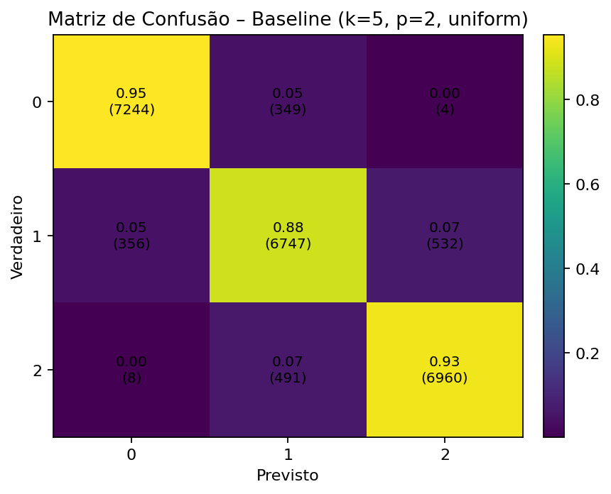
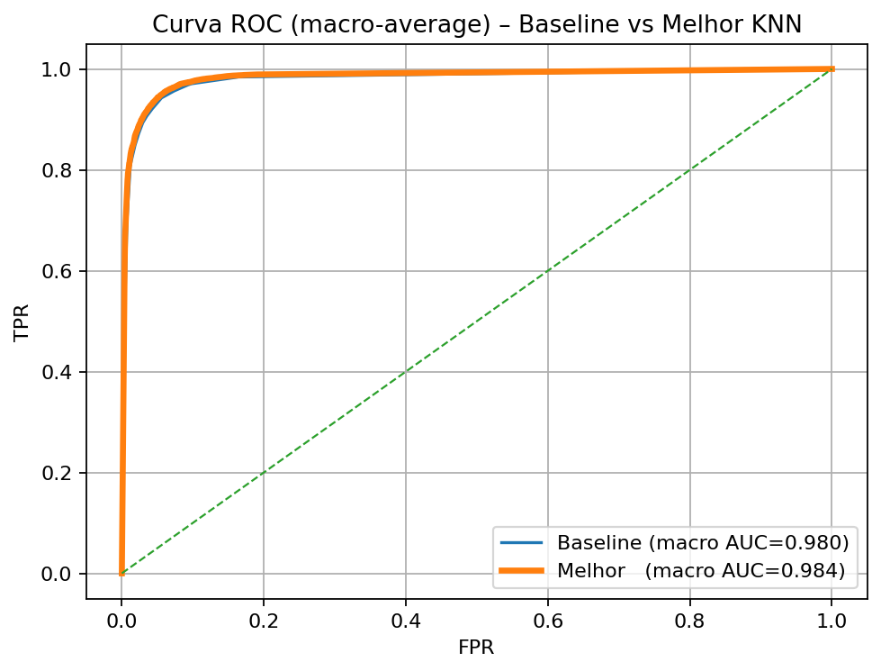
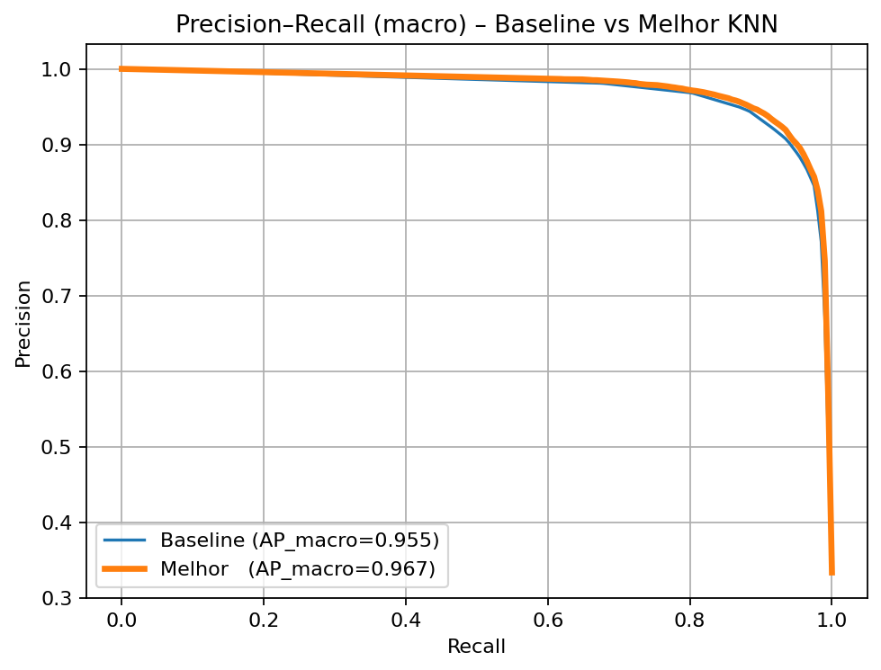
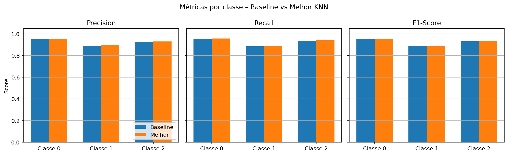
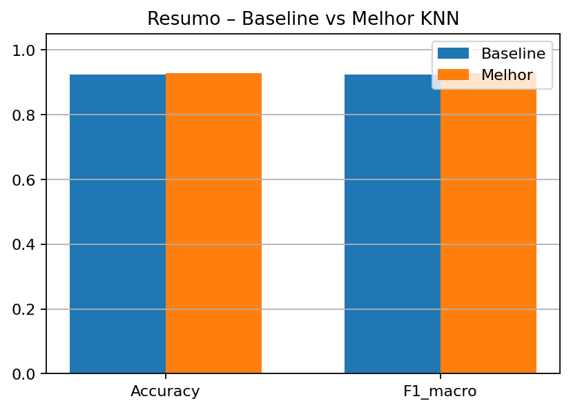

# N1 - Machine Learning - Comitê de Classificadores

## Alunos
- Alberto Zilio  
- Lucas Carvalho Esteffens  
- Roni Pereira  

---

## 1. Introdução
O reconhecimento de padrões é um dos principais objetivos da área de *Machine Learning*. A tarefa de **classificação supervisionada** consiste em duas etapas principais:  
1. **Treinamento** — o modelo aprende padrões a partir de exemplos rotulados.  
2. **Teste** — o modelo aplica o conhecimento aprendido para prever classes de novas instâncias.  

Nesta atividade (N1), o objetivo é criar um **comitê de classificadores** aplicando **ao menos dois algoritmos de ML** sobre um dataset real, comparar os resultados e avaliar o desempenho por métricas como **acurácia, erro, matriz de confusão, precisão, recall, F1-score e curva ROC**.

---

## 2. Dataset Escolhido: *Traffic Flow Prediction Dataset*
O dataset selecionado é o **Traffic Flow Prediction Dataset**, que tem como objetivo prever o volume de tráfego em rodovias utilizando dados históricos, temporais e contextuais.

### Estrutura geral
- **36 sensores** distribuídos em rodovias da região de Washington D.C./Virgínia; amostras a cada **15 minutos**.  
- Objetivo: prever o **volume de tráfego 15 minutos à frente**.  

### Conjuntos disponíveis
- **Treino:**  
  - `tra_X_tr` (1 × 1261) — cada item é uma matriz **36 × 48**  
  - `tra_Y_tr` (36 × 1261) — alvo (volume de tráfego)  
- **Teste:**  
  - `tra_X_te` (1 × 840) — cada item é **36 × 48**  
  - `tra_Y_te` (36 × 840) — alvo  
- **Matriz de adjacência** `tra_adj_mat` (36 × 36) — conectividade entre sensores.

### Estrutura das 48 features (por sensor)
- **f0–f9:** 10 lags do volume de tráfego (normalizados).  
- **f10–f16:** *one-hot* do dia da semana.  
- **f17–f40:** *one-hot* da hora do dia (0–23).  
- **f41–f44:** *one-hot* da direção da via.  
- **f45:** número de faixas.  
- **f46:** identificador/nome da estrada.

---

## 3. Metodologia
1. **Tratamento e unificação**  
   - Conversão das estruturas do `.mat` para tensores NumPy, concatenação treino+teste e criação de um dataset tabular.  
2. **Discretização do alvo**  
   - O alvo contínuo `target_reg` foi transformado em **três classes** por **tercis calculados somente no conjunto de treino** (evitando vazamento):  
     - **Classe 0** → baixo tráfego  
     - **Classe 1** → médio tráfego  
     - **Classe 2** → alto tráfego  
3. **Divisão 70/30**  
   - Split **70%/30%** para treino/teste (variante aleatória; opção temporal também testável).  
4. **Modelagem (KNN)**  
   - **Baseline**: `k=5`, distância **Euclidiana (p=2)**, `weights='uniform'`.  
   - **Otimização**: busca manual por `k ∈ {3,5,7,9}`, `p ∈ {1,2}` (Manhattan/Euclidiana), `weights ∈ {uniform, distance}`.  
5. **Avaliação**  
   - Acurácia, Matriz de Confusão, *classification report* (precision/recall/F1).  
   - Curvas **ROC** e **Precision–Recall** (macro-average e por classe).

---

## 4. Resultados

### 4.1 KNN – Baseline
- Configuração: **k=5**, `p=2` (Euclidiana), `weights='uniform'`  
- **Acurácia:** **0.923**  
- *Classification report* (resumo):  
  - Classe 0 (baixo): precision≈0.952, recall≈0.954  
  - Classe 1 (médio): precision≈0.889, recall≈0.884  
  - Classe 2 (alto):  precision≈0.928, recall≈0.933  

**Matriz de Confusão — Baseline**  

> **Leitura:** classes 0 e 2 têm excelente separação; a classe 1 é a mais desafiadora (confusões com vizinhas).

---

### 4.2 KNN – Melhor Configuração
Após a busca de hiperparâmetros, a melhor configuração foi:
- **k=7**, `p=1` (**Manhattan**), `weights='distance'`  
- **Acurácia:** **0.927**  

**Matriz de Confusão — Melhor KNN**  

> **Leitura:** redução de erros na **classe 1** e leve ganho geral (accuracy/F1_macro).

---

### 4.3 Comparações Visuais

**Curva ROC (macro-average) — Baseline vs Melhor**  
  
- Ambas as curvas apresentam **AUC alto** (~0.97–0.98); o modelo otimizado supera levemente o baseline, sobretudo na classe 1.

**Precision–Recall (macro-average) — Baseline vs Melhor**  
  
- O modelo otimizado apresenta **maior precisão para o mesmo recall**, indicando menos falsos positivos, em especial na classe 1.

**Métricas por classe (Precision, Recall, F1)**  
  
- Classes **0** (baixo) e **2** (alto): métricas consistentemente altas nos dois modelos.  
- **Classe 1** (médio): **melhora** de F1 (≈0.886 → ≈0.892) no modelo otimizado.

**Resumo — Accuracy e F1_macro**  
  
- **Baseline:** Accuracy = **0.923**, F1_macro = **0.923**  
- **Melhor KNN:** Accuracy = **0.927**, F1_macro = **0.927**

---

## 5. Conclusão
- O problema de **três classes** (baixo/médio/alto) é adequado para avaliar classificadores; a classe intermediária tende a ser a mais difícil.  
- O **KNN baseline** já apresentou desempenho **muito alto** (≈92%).  
- A **otimização** (k=7, Manhattan, pesos por distância) trouxe **ganho consistente**, principalmente na **classe média**, com ligeiro aumento em accuracy e F1_macro.  
- As curvas **ROC** e **PR** reforçam a boa separação das classes — destaque para as classes de **baixo** e **alto** tráfego.  
- Próximos passos para o **comitê**: incluir e comparar **Árvore de Decisão** (e/ou SVM), consolidando a escolha do melhor modelo para o cenário de tráfego.

---
