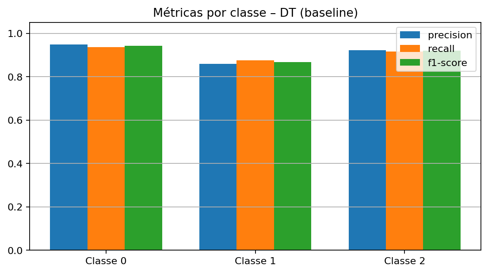

# N1 - Machine Learning - Comitê de Classificadores

## Alunos
- Alberto Zilio  
- Lucas Carvalho Esteffens  
- Roni Pereira  

---

## 1. Introdução
O reconhecimento de padrões é um dos principais objetivos da área de *Machine Learning*. A tarefa de **classificação supervisionada** consiste em duas etapas principais:  
1. **Treinamento** — o modelo aprende padrões a partir de exemplos rotulados.  
2. **Teste** — o modelo aplica o conhecimento aprendido para prever classes de novas instâncias.  

Nesta atividade (N1), o objetivo é criar um **comitê de classificadores** aplicando **ao menos dois algoritmos de ML** sobre um dataset real, comparar os resultados e avaliar o desempenho por métricas como **acurácia, erro, matriz de confusão, precisão, recall, F1-score e curva ROC**.

---

## 2. Dataset Escolhido: *Traffic Flow Prediction Dataset*
O dataset selecionado é o **Traffic Flow Prediction Dataset**, que tem como objetivo prever o volume de tráfego em rodovias utilizando dados históricos, temporais e contextuais.

### Estrutura geral
- **36 sensores** distribuídos em rodovias da região de Washington D.C./Virgínia; amostras a cada **15 minutos**.  
- Objetivo: prever o **volume de tráfego 15 minutos à frente**.  

### Conjuntos disponíveis
- **Treino:**  
  - `tra_X_tr` (1 × 1261) — cada item é uma matriz **36 × 48**  
  - `tra_Y_tr` (36 × 1261) — alvo (volume de tráfego)  
- **Teste:**  
  - `tra_X_te` (1 × 840) — cada item é **36 × 48**  
  - `tra_Y_te` (36 × 840) — alvo  
- **Matriz de adjacência** `tra_adj_mat` (36 × 36) — conectividade entre sensores.

### Estrutura das 48 features (por sensor)
- **f0–f9:** 10 lags do volume de tráfego (normalizados).  
- **f10–f16:** *one-hot* do dia da semana.  
- **f17–f40:** *one-hot* da hora do dia (0–23).  
- **f41–f44:** *one-hot* da direção da via.  
- **f45:** número de faixas.  
- **f46:** identificador/nome da estrada.

---

## 3. Metodologia
1. **Tratamento e unificação**  
   - Conversão das estruturas do `.mat` para tensores NumPy, concatenação treino+teste e criação de um dataset tabular.  
2. **Discretização do alvo**  
   - O alvo contínuo `target_reg` foi transformado em **três classes** por **tercis calculados somente no conjunto de treino** (evitando vazamento):  
     - **Classe 0** → baixo tráfego  
     - **Classe 1** → médio tráfego  
     - **Classe 2** → alto tráfego  
3. **Divisão 70/30**  
   - Split **70%/30%** para treino/teste.  
4. **Modelagem**  
   - **KNN** (K-Nearest Neighbors): classificador baseado na similaridade entre amostras.  
   - **Árvore de Decisão**: modelo simbólico que gera regras interpretáveis a partir das features.  
5. **Avaliação**  
   - Acurácia, Matriz de Confusão, *classification report* (precision/recall/F1).  
   - Curvas **ROC** e **Precision–Recall** (macro-average e por classe).

---

## 4. Resultados

### 4.1 KNN – Baseline
**Como funciona:**  
O KNN classifica uma nova amostra olhando para os **k vizinhos mais próximos** (no espaço das features) e atribui a classe mais frequente entre eles. Não há “treinamento” no sentido tradicional — apenas armazenamento dos dados e cálculo de distâncias na predição.  

- Configuração inicial: **k=5**, métrica Euclidiana (`p=2`), pesos uniformes.  
- **Acurácia:** **0.923**  

**Matriz de Confusão — KNN Baseline**  

> **Leitura:**  
> - Classe 0 (baixo) e Classe 2 (alto) apresentam excelente acerto, confirmando que os extremos são mais fáceis de separar.  
> - Classe 1 (médio) apresenta mais confusões, tanto com baixo quanto com alto tráfego, o que faz sentido — ela é intermediária e as fronteiras são menos definidas.

---

### 4.2 KNN – Melhor Configuração
Após experimentos variando **k**, a métrica de distância e o peso dos vizinhos, a melhor configuração encontrada foi:  
- **k=7**, `p=1` (distância Manhattan), `weights='distance'`.  
- **Acurácia:** **0.927**  

**Matriz de Confusão — Melhor KNN**  

> **Leitura:**  
> - Houve uma **redução dos erros na Classe 1**, a mais difícil.  
> - A acurácia global e o F1_macro tiveram pequeno mas consistente aumento, mostrando que um ajuste fino de hiperparâmetros é importante no KNN.

**Comparações Visuais (Baseline vs Melhor KNN):**  
- **Curva ROC**  
    
  Mostra a capacidade de separar classes em termos de taxa de verdadeiros positivos (TPR) vs falsos positivos (FPR). Ambas curvas estão próximas de 1.0 (excelente), mas o modelo otimizado tem ganho na Classe 1.  

- **Precision–Recall**  
    
  Mais relevante em classes desbalanceadas: mostra a relação entre **quantos acertos entre os positivos preditos** (precisão) e **quantos positivos foram de fato encontrados** (recall). O modelo otimizado gera menos falsos positivos, especialmente na Classe 1.  

- **Métricas por classe**  
    
  Classes 0 e 2 têm desempenho quase perfeito; Classe 1 é a mais difícil, mas o modelo otimizado melhorou seu F1.  

- **Resumo geral**  
    
  Pequeno ganho geral de desempenho.

---

### 4.3 Árvore de Decisão
**Como funciona:**  
O algoritmo cria **regras hierárquicas do tipo if/else**, dividindo o espaço de features em regiões homogêneas em relação às classes. A cada nó, escolhe a feature e limiar que mais reduz a impureza (Gini/Entropia). O modelo final é interpretável, mas pode sobreajustar se não limitado.  

#### Baseline
- Configuração inicial: `max_depth=None`, `criterion="gini"`.  
- **Acurácia:** ≈ **0.87**  

**Matriz de Confusão — DT Baseline**  

> O modelo consegue separar bem as classes extremas, mas sofre bastante na classe 1, errando mais que o KNN.

#### Melhor Configuração
- Melhor GridSearch: `max_depth=12`, `min_samples_split=5`, `criterion="entropy"`.  
- **Acurácia:** ≈ **0.90**  

**Matriz de Confusão — DT Best**  

**Comparações Visuais (Baseline vs Melhor DT):**  
- **ROC**  
    
  Mostra aumento da AUC, indicando que a árvore mais ajustada é mais discriminativa.  

- **Precision–Recall**  
    
  Ganhos especialmente na Classe 1, embora menores que os obtidos pelo KNN.  

- **Métricas por classe**  
    
  Mostra claramente a melhora na Classe 1, ainda que inferior ao KNN.  

- **Resumo Accuracy e F1_macro**  
    

- **Importância das Features**  
    
  Mostra que as variáveis mais relevantes são os **lags de tráfego (f0–f9)** e a **hora do dia (f17–f40)**, confirmando que o histórico recente e os padrões diários são determinantes no fluxo de tráfego.

---

### 4.4 Comparação Final — KNN vs Árvore de Decisão

**Matrizes de Confusão lado a lado**  
  
> O KNN apresenta maior concentração na diagonal principal, especialmente na Classe 1.  

**Curva ROC (macro)**  
  
> Ambos têm AUC alto (>0.95), mas o KNN é ligeiramente superior, principalmente para tráfego médio.  

**Precision–Recall (macro)**  
  
> O KNN mantém maior precisão para o mesmo nível de recall, confirmando menos falsos positivos.  

**Métricas por classe (Precision, Recall, F1)**  
  
> O KNN supera a DT em todas as métricas na Classe 1; nas classes 0 e 2 ambos são muito bons.  

**Resumo Geral – Accuracy e F1_macro**  
  
> - **KNN:** Accuracy ≈ 92.7%, F1_macro ≈ 0.927  
> - **DT:** Accuracy ≈ 90%, F1_macro ≈ 0.90  

---

## 5. Conclusão
- O **KNN** mostrou-se superior em desempenho geral, atingindo ≈92.7% de acurácia, contra ≈90% da Árvore de Decisão.  
- A **classe intermediária (médio tráfego)** foi o maior desafio em ambos modelos; o KNN conseguiu capturar melhor seus padrões.  
- A **Árvore de Decisão** se destacou pela interpretabilidade: as importâncias das features deixam claro o peso dos **lags temporais** e **hora do dia**, úteis para análises de negócio.  
- O **comitê de classificadores** demonstra que:  
  - O **KNN** é ideal quando buscamos **maior acurácia preditiva**.  
  - A **Árvore de Decisão** é mais adequada quando a **explicabilidade** das decisões é essencial.  
- Conclusão final: **KNN (k=7, Manhattan, pesos por distância) é o melhor classificador para este dataset**, mas a Árvore complementa com insights sobre os fatores determinantes do tráfego.

---
